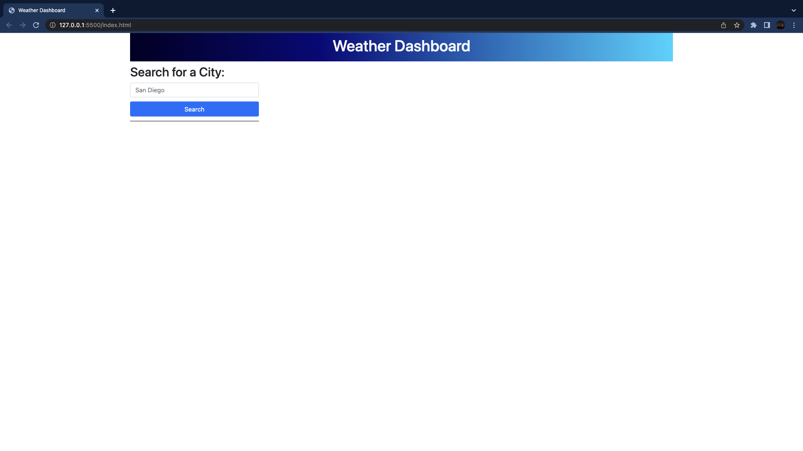
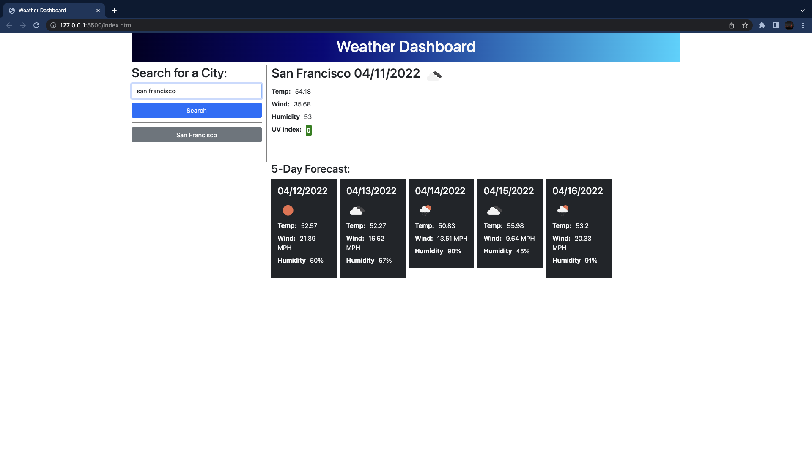
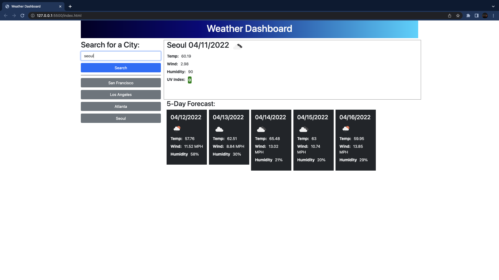
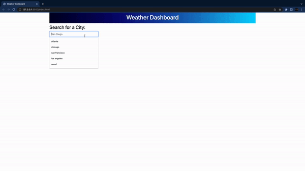

# Homework 6: Weather Dashboard

## Description 

For this week's homework, we were assigned to create a Weather Dashboard from scratch using a third-party API, that will allow users to search whatever city they want to check the weather conditions in case they are traveling or worried about their loved ones.

We used the [OpenWeather One Call API](https://openweathermap.org/api/one-call-api) to retrieve weather data for cities.

As always, here is the **User Story** and **Acceptance Criteria**:

## User Story

```
AS A traveler
I WANT to see the weather outlook for multiple cities
SO THAT I can plan a trip accordingly
```

## Acceptance Criteria

```
GIVEN a weather dashboard with form inputs
WHEN I search for a city
THEN I am presented with current and future conditions for that city and that city is added to the search history
WHEN I view current weather conditions for that city
THEN I am presented with the city name, the date, an icon representation of weather conditions, the temperature, the humidity, the wind speed, and the UV index
WHEN I view the UV index
THEN I am presented with a color that indicates whether the conditions are favorable, moderate, or severe
WHEN I view future weather conditions for that city
THEN I am presented with a 5-day forecast that displays the date, an icon representation of weather conditions, the temperature, the wind speed, and the humidity
WHEN I click on a city in the search history
THEN I am again presented with current and future conditions for that city
```

## Installation

Below is my GitHub Repo and the Deployed Website:
- GitHub Repo: https://github.com/jasonchun7/hw-6-weather-dashboard
- Deployed: https://jasonchun7.github.io/hw-6-weather-dashboard/

## Usage 

From the Landing Page, you're presented with a typical header, and a form on the left to search your favorite city.



Once you search for a city, then that city is saved below the Search Bar, and also saved to local storage. 
You'll noticed most of the Main content along with the 5-day Forecast is done dynamically with JavaScript.



You can search for multiple cities and all will be saved below the Search Bar (and local storage) as mentioned. 



Here is the full demo:



## Credits

Sunday on April 10, the Instructor (Trey) was kind enough to go over and live code with us for this week's homework. Most, if not ALL of my code is referenced from his GitHub Repo provided below:
- https://github.com/treyeckels/weather-dashboard